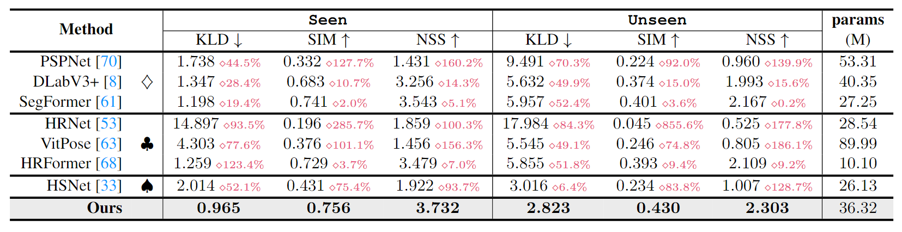

# PIAL-Net
PyTorch implementation of our PIAL models. 
The code will coming soon.
1. [📎 Paper Link](#1)
2. [💡 Abstract](#2)
3. [📖 Method](#3)
4. [📂 Dataset](#4)
5. [📊 Experimental Results](#7)
6. [✉️ Statement](#8)
7. [✨ Other Relevant Works](#9)
8. [🔍 Citation](#10)

## 📎 Paper Link <a name="1"></a> 
* Leverage Interactive Affinity for Affordance Learning (CVPR2023) [[pdf]()] [[Supplementary Material]()]
> Authors:
> Hongchen Luo, Wei Zhai, Jing Zhang, Yang Cao, Dacheng Tao

## 💡 Abstract <a name="2"></a> 
Perceiving potential "action possibilities" (i.e., affordance) regions of images and learning interactive functionalities of objects from human demonstration is a challenging task due to the diversity of human-object interactions. Prevailing affordance learning algorithms often adopt the label assignment paradigm and presume that there is a unique relationship between functional region and affordance label, yielding poor performance when adapting to unseen environments with large appearance variations. In this paper, we propose to leverage interactive affinity for affordance learning, i.e., extracting interactive affinity from human-object interaction and transferring it to non-interactive objects. Interactive affinity, which represents the contacts between different parts of the human body and local regions of the target object, can provide inherent cues of interconnectivity between humans and objects, thereby reducing the ambiguity of the perceived action possibilities. Specifically, we propose a pose-aided interactive affinity learning framework that exploits human pose to guide the network to learn the interactive affinity from human-object interactions. Particularly, a keypoint heuristic perception (KHP) scheme is devised to exploit the keypoint association of human pose to alleviate the uncertainties due to interaction diversities and contact occlusions. Besides, a contact-driven affordance learning (CAL) dataset is constructed by collecting and labeling over 5,000 images. Experimental results demonstrate that our method outperforms the representative models regarding objective metrics and visual quality. 
<p align="center">
     <br />
    <em> 
    </em>
</p>


**Interactive affinity.** (a) This paper explores the associations of interactable regions between diverse images by considering the context of contact regions with different body parts. (b) This paper considers leveraging the connection of human pose keypoints to alleviate the uncertainties due to interaction diversities and contact occlusions.

	

<p align="center">
     <br />
    <em> 
    </em>
</p>

**Motivation.**  (a) This paper explores the associations of interactable regions between diverse images by considering the context of contact regions with different body parts. (b) This paper considers leveraging the connection of human pose keypoints to alleviate the uncertainties due to interaction diversities and contact occlusions.

## 📖 Method <a name="3"></a> 

<p align="center">
     <br />
    <em> 
    </em>
</p>

**Overview of the proposed pose-aided interactive affinity learning framework.** Our model mainly consists of an interactive feature enhancement (IFE) module and a keypoint heuristic perception (KHP) scheme.

## 📂 Dataset <a name="4"></a> 

<p align="center">
     <br />
    <em> 
    </em>
</p>

**Some examples and properties of Contact-driven Affordance Learning (CAL) dataset.** (a) Statistics on the quantity of interactive and non-interactive images in each affordance category. (b) Confusion matrix for each affordance category interacting with body parts. (c) Some examples of interactive and non-interactive images and annotations in the dataset.

## 📊 Experimental Results <a name="7"></a> 

<p align="center">
     <br />
    <em> 
    </em>
</p>

**The results of different methods on the CAL dataset.** 

<p align="center">
     <br />
    <em> 
    </em>
</p>


**Visualization of prediction results.** We show the visualization results of our model, few-shot segmentation (HSNet [33]), the best human pose estimation model (HRFormer [68]) and the segmentation model (SegFormer [61]).

## ✉️ Statement <a name="8"></a> 
This project is for research purpose only, please contact us for the licence of commercial use. For any other questions please contact [lhc12@mail.ustc.edu.cn](lhc12@mail.ustc.edu.cn) or [wzhai056@mail.ustc.edu.cn](wzhai056@mail.ustc.edu.cn).

## ✨ Other Relevant Works <a name="9"></a> 

1.The paper "One-Shot Affordance Detection" was accepted by IJCAI2021 and the corresponding paper and code are available from [https://github.com/lhc1224/OSAD_Net](https://github.com/lhc1224/OSAD_Net).

2.The language-annotated PAD-L dataset is available for download via [ [link](https://arxiv.org/abs/2202.12076) ], and related papers and code can be downloaded from the [[link](https://github.com/lulsheng/CBCE-Net)].

3.The paper "Grounding 3D Object Affordance from 2D Interactions in Images" and the corresponding code are obtained from [https://github.com/yyvhang/IAGNet](https://github.com/yyvhang/IAGNet).

## 🔍 Citation <a name="9"></a> 

```
@inproceedings{Leverageluo,
  title={Leverage Interactive Affinity for Affordance Learning},
  author={Luo, Hongchen and Zhai, Wei and Zhang, Jing and Cao, Yang and Tao, Dacheng},
  booktitle={CVPR},
  year={2023}
}
```
